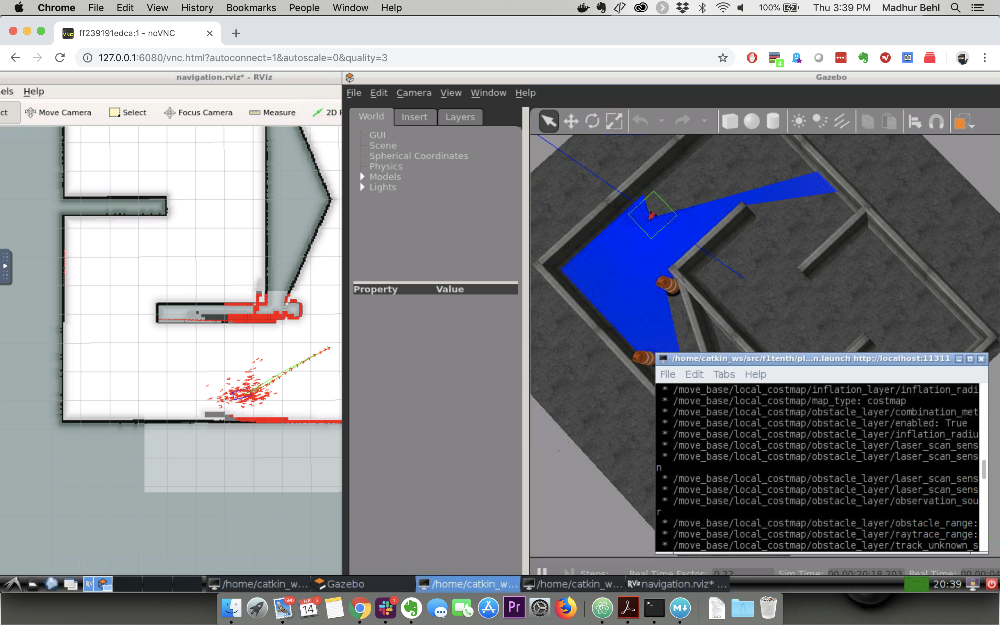

F1/10 Docker 
=========================

Docker image to provide HTML5 VNC interface to access the entire F1/10 Perception, Planning, and Control tutorials available at:
<https://github.com/linklab-uva/f1tenth_gtc_tutorial>

The image inlcudes, Ubuntu 16.04 xenial, ROS Kinetic Desktop Full, Rviz, and Gazebo.

Maintained by:

Madhur Behl, Assistant Professor, University of Virginia,
<https://madhurbehl.com>
</br>
F1/10 Race Director </br>
Email: madhur.behl@virginia.edu


Quick Start
-------------------------

Run the docker image and open port `6080`

```
docker run -it --rm -p 6080:80 
```

Browse http://127.0.0.1:6080/




Connect with VNC Viewer and protect by VNC Password
------------------

Forward VNC service port 5900 to host by

```
docker run -it --rm -p 6080:80 -p 5900:5900 
```

Now, open the vnc viewer and connect to port 5900. If you would like to protect vnc service by password, set environment variable `VNC_PASSWORD`, for example

```
docker run -it --rm -p 6080:80 -p 5900:5900 -e VNC_PASSWORD=mypassword 
```

A prompt will ask password either in the browser or vnc viewer.

Acknoledgements
------------------

Many thanks to dorowu for creating the dorowu/ubuntu-desktop-lxde-vnc image.
<https://hub.docker.com/r/dorowu/ubuntu-desktop-lxde-vnc/>
